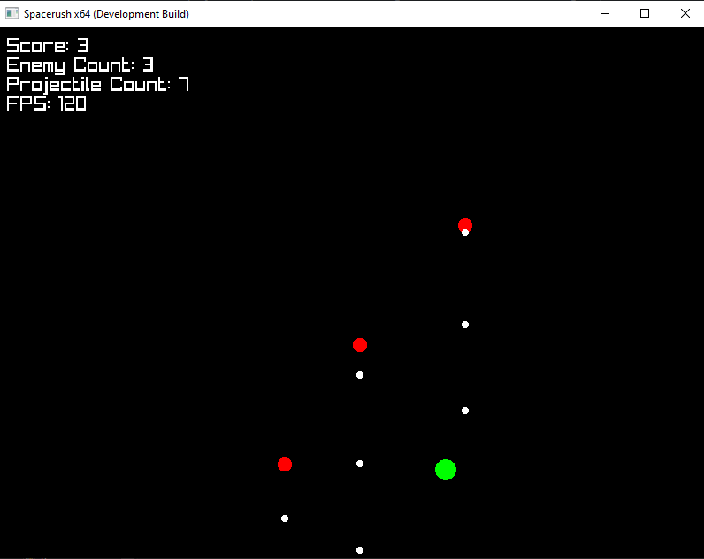

# Spacerush
A simple 2D space-shooter game

## Dependencies
You need to install [raylib](https://github.com/raysan5/raylib) using [vcpkg](https://github.com/microsoft/vcpkg)

## Screenshot

## To-Do
- Player power ups (increase bullet size, reduce player size, increase player speed, etc.)
- Enemy progression (increasing bullet sizes, increasing bullet speeds)
- Timer?
- Visuals
- Sound effects
- Move to CMake build system to support linux builds
